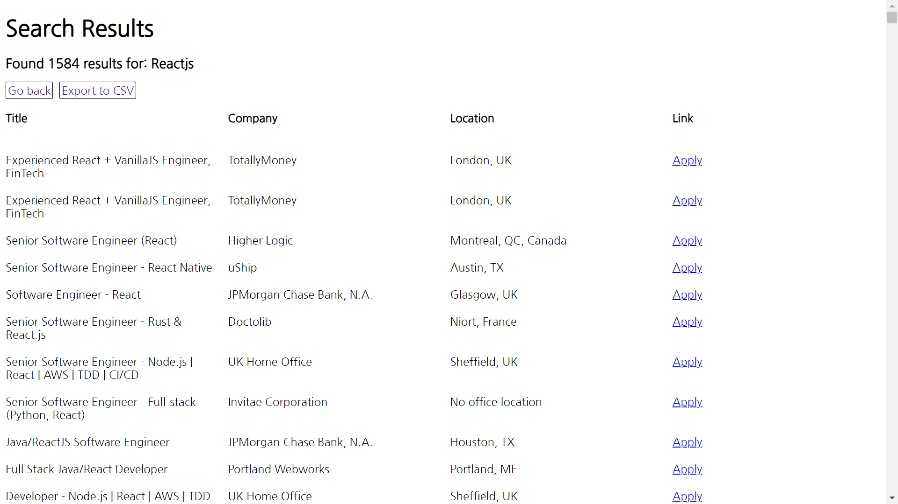
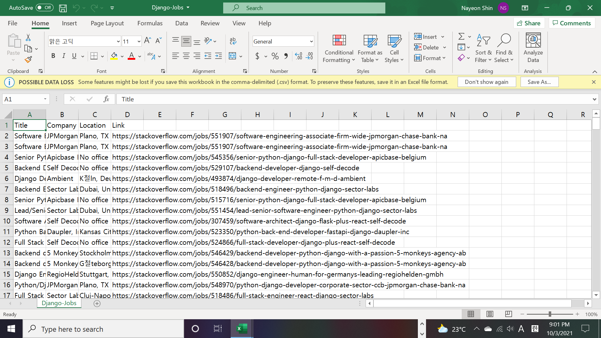

# [Job Search in Flask](https://job-search-in-flask.herokuapp.com/)

Job Search in Flask is a Stack Overflow job scraper and search in Flask.\
Note: I stopped maintaining this project on October 26, 2021. (i.e. The scraper and search will break once Stack Overflow people update their website.)

## Features

### 1. Search

- Homepage

  

- Result pages

  **Django**

  

  ---

  **Reactjs**

  

### 2. Export result to a CSV file.

**Django**

---

**Reactjs**

